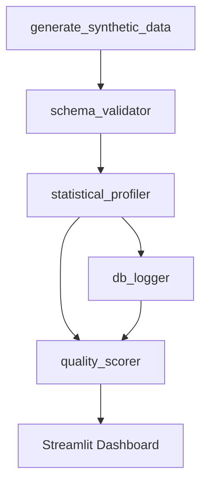

# Synthetic Data Quality Validator

Synthetic Data Quality Validator is a practical end-to-end pipeline for generating realistic synthetic datasets, validating data quality, detecting anomalies, scoring dataset health, and visualizing results in a dashboard. It is designed to feel like a real working data quality workflow, with clear outputs, repeatable runs, and persistent run history for trend tracking.

## Overview

This project creates synthetic user and transaction datasets, intentionally injects known quality issues, and then measures how well the pipeline can detect them. The result is a compact but production-minded example of schema validation, statistical profiling, anomaly detection, quality scoring, database logging, and dashboard-based monitoring. It works well as a demo, an internal starter project, or a reference implementation for ML and analytics teams that want better visibility into synthetic data quality.

## Folder Structure

```text
synthetic-data-quality-validator/
|-- data/
|-- src/
|-- dashboard/
|-- docs/
|-- tests/
|-- .env
|-- .gitignore
|-- README.md
`-- requirements.txt
```

## Setup

1. Create and activate a Python virtual environment.
2. Install dependencies with `pip install -r requirements.txt`.
3. Update the `.env` file as needed for your environment.

## How To Run Each Module

- Full pipeline: `python run_pipeline.py`
- Data generation: `python src/generate_synthetic_data.py`
- Schema validation: `python src/schema_validator.py`
- Statistical profiling: `python src/statistical_profiler.py`
- Quality scoring: `python src/quality_scorer.py`
- Database setup: `python src/db_logger.py`
- Tests: `pytest -q tests/test_pipeline.py`

## Dashboard

Launch the dashboard with `streamlit run dashboard/app.py`. It brings together quality scorecards, validation issue breakdowns, anomaly views, statistical summaries, trend tracking, recommendations, and a raw data explorer in one place.

## Architecture

The pipeline is organized as a clean sequence of stages. Each module produces artifacts that are reused by downstream steps and surfaced in the dashboard.



For full operating guidance, troubleshooting, and output references, see [docs/runbook.md](docs/runbook.md).

