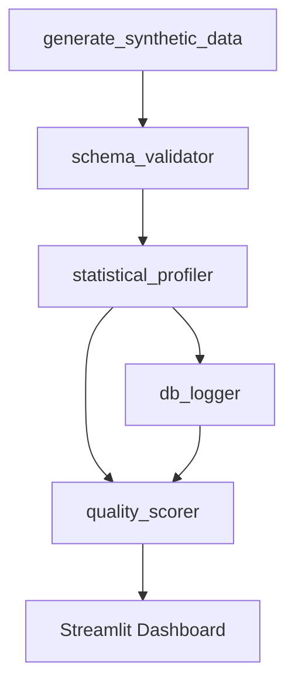

# Synthetic Data Quality Validator Runbook

## 1. Overview

The Synthetic Data Quality Validator pipeline helps teams generate realistic synthetic datasets and evaluate whether those datasets are reliable enough for testing, analytics, and model experimentation. It automatically creates sample user and transaction data, validates records against schema rules, profiles statistical behavior, detects anomalies, and calculates dataset quality scores. The pipeline also stores run history in SQLite so quality can be tracked over time instead of being reviewed as a one-off snapshot. A Streamlit dashboard ties the outputs together so engineers and analysts can inspect issues quickly.

## 2. Architecture



## 3. Prerequisites

- Python 3.9+
- Install project dependencies:

```bash
pip install -r requirements.txt
```

## 4. Configuration

Create a `.env` file in the project root.

Example:

```env
DB_CONNECTION=sqlite:///data/quality_logs.db
```

Guidance:

- `DB_CONNECTION` controls where pipeline run history is stored.
- The default SQLite database is suitable for local development and dashboard testing.
- If needed, the value can later be replaced with another SQLAlchemy-compatible connection string.

## 5. Running The Pipeline

### Full Run

```bash
python run_pipeline.py
```

This command runs the complete workflow in sequence:

1. Synthetic data generation
2. Schema validation
3. Statistical profiling and anomaly detection
4. Quality scoring
5. Database logging

### Individual Modules

```bash
python src/generate_synthetic_data.py
```

Generates synthetic user and transaction datasets and injects controlled quality issues for downstream validation.

```bash
python src/schema_validator.py
```

Validates each dataset against schema, null, type, range, format, and duplicate rules.

```bash
python src/statistical_profiler.py
```

Builds descriptive profiles, tests normality, and identifies anomalies using Z-score and IQR methods.

```bash
python src/quality_scorer.py
```

Calculates completeness, validity, consistency, accuracy, and the final quality grade.

```bash
python src/db_logger.py
```

Initializes the SQLite database and prepares logging tables for pipeline history.

## 6. Running The Dashboard

```bash
streamlit run dashboard/app.py
```

The dashboard reads the latest generated CSV, JSON, and SQLite outputs from the `data/` directory.

## 7. Understanding Quality Metrics

### What is Completeness Score?

Completeness measures how much required data is actually present. The pipeline calculates null percentages for each column, converts them into a score using `100 - (null_percentage * 100)`, and then averages those values across the dataset.

### What is Validity Score?

Validity measures how many records pass schema validation. In practice, it reflects the percentage of rows that satisfy the required field formats, value ranges, and allowed categories.

### What is Consistency Score?

Consistency focuses on duplicate behavior. The score is calculated as `100 - (duplicate_percentage * 100)`, so datasets with more duplicate records receive a lower score.

### What is Accuracy Score?

Accuracy is based on anomaly detection results. The pipeline compares anomaly counts to total rows and converts that into a score with `100 - (anomaly_percentage * 100)`.

### How is Overall Grade calculated?

The overall score is the weighted average of completeness, validity, consistency, and accuracy. Each metric contributes 25% of the final score.

| Score Range | Grade | Meaning |
|---|---|---|
| 90-100 | A | Excellent |
| 80-89 | B | Good |
| 70-79 | C | Acceptable |
| 60-69 | D | Poor |
| Below 60 | F | Critical |

## 8. Understanding Anomaly Detection

### What is Z-score method?

The Z-score method measures how far a value is from the average using standard deviations. In this pipeline, values with an absolute Z-score greater than 3 are treated as unusually far from the center of the distribution.

### What is IQR method?

The IQR method looks at the middle spread of the data. It calculates the distance between the 25th percentile and the 75th percentile, then flags values that fall well outside that normal middle range.

### When to use each?

- Use Z-score when the data is roughly bell-shaped and you want a standard distance-from-mean signal.
- Use IQR when the data may be skewed or when you want a method that is less sensitive to extreme values.
- Using both together gives a more balanced view of suspicious records.

## 9. Output Files Reference

| Filename | Created By | Contains |
|---|---|---|
| `data/synthetic_users.csv` | `generate_synthetic_data.py` | Synthetic user records with intentionally injected data quality issues |
| `data/synthetic_transactions.csv` | `generate_synthetic_data.py` | Synthetic transaction records with intentionally injected data quality issues |
| `data/user_validation_report.csv` | `schema_validator.py` | Row-level validation failures for the users dataset |
| `data/transaction_validation_report.csv` | `schema_validator.py` | Row-level validation failures for the transactions dataset |
| `data/validation_summary.json` | `schema_validator.py` | Dataset-level validation totals, pass rates, and issue counts |
| `data/user_profile.json` | `statistical_profiler.py` | Statistical profile, anomaly summary, and completeness metrics for users |
| `data/transaction_profile.json` | `statistical_profiler.py` | Statistical profile, anomaly summary, and completeness metrics for transactions |
| `data/anomalies.csv` | `statistical_profiler.py` | All anomaly records flagged by Z-score and IQR methods |
| `data/quality_scores.json` | `quality_scorer.py` | Quality scores, overall grades, and recommendations |
| `data/quality_logs.db` | `db_logger.py` | SQLite history of pipeline runs and column statistics |

## 10. Troubleshooting

| Problem | Likely Cause | Recommended Fix |
|---|---|---|
| `ModuleNotFoundError` when running a script | Dependencies are not installed in the active Python environment | Run `pip install -r requirements.txt` and confirm the correct Python environment is active |
| Dashboard shows missing file warnings | The pipeline outputs have not been generated yet | Run `python run_pipeline.py` before launching Streamlit |
| Trend chart says to run the pipeline multiple times | Fewer than two logged runs exist in the database | Run the full pipeline again to create more history |
| SQLite database is not created | The `.env` connection string is invalid or the project cannot write to `data/` | Check `DB_CONNECTION` and confirm the project directory is writable |
| Results look outdated | Older artifacts are still being displayed | Re-run the full pipeline so CSV, JSON, and database outputs are refreshed |
